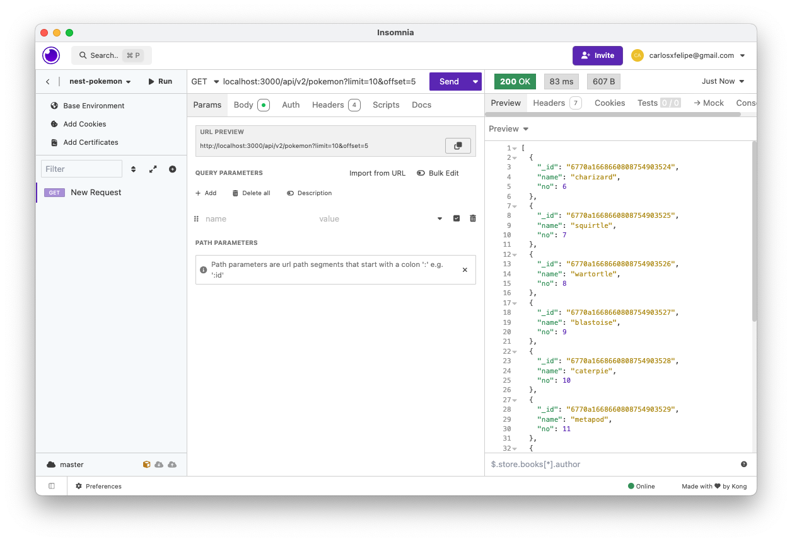

# Executar em desenvolvimento

1. Clonar o repositório
2. Executar

```
npm install
```

3. Ter o Nest CLI instalado

```
npm i -g @nestjs/cli
```

4. Subir o banco de dados

```
docker-compose up -d
```

5. Reconstruir o banco de dados com a semente

```
localhost:3000/api/v2/seed
```

6. Iniciar o servidor em modo de desenvolvimento

```
npm run start:dev
```

## Stack utilizado

- MongoDB
- Nest
